# IoT Manager

A frontend Application for [IoTService](https://github.com/Rizzor93/IoTService).

### Dependency:

* [CMake](https://cmake.org/) 3.20
* [Qt](https://www.qt.io) 5.15.2
* [gRPC](https://grpc.io) 1.41.0
* [Protobuf](https://developers.google.com/protocol-buffers) 3.17.3.0
* [OpenSSL](https://www.openssl.org/) 1.1.1k

### How to Build ?

#### CMake:

````
cd IoTManager
mkdir -p cmake/build
pushd cmake/build
cmake \
  -DQt5_DIR=<PATH_TO_QT5> \
  -DgRPC_DIR=<PATH_TO_gRPC> \
  -Dabsl_DIR=<PATH_TO_ABSL> \
  -DProtobuf_DIR=<PATH_TO_PROTOBUF>  \
  -DOPENSSL_ROOT_DIR=<PATH_TO_OPENSSL> \
  ../..
  
make -j 
````

## Tasks:

- [ ] Add Data-Visualization
- [ ] Add Option
    - [x] configure connection
    - [ ] secure option


# Gallery

### Dashboard
#### DeviceList:
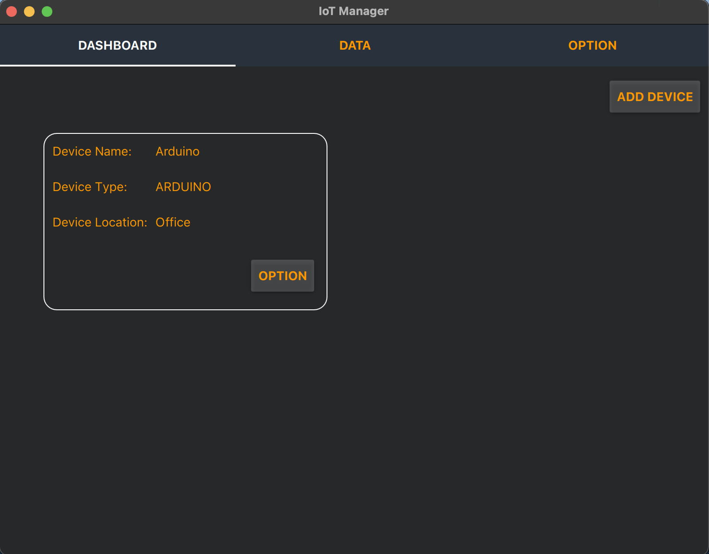
#### Add device:
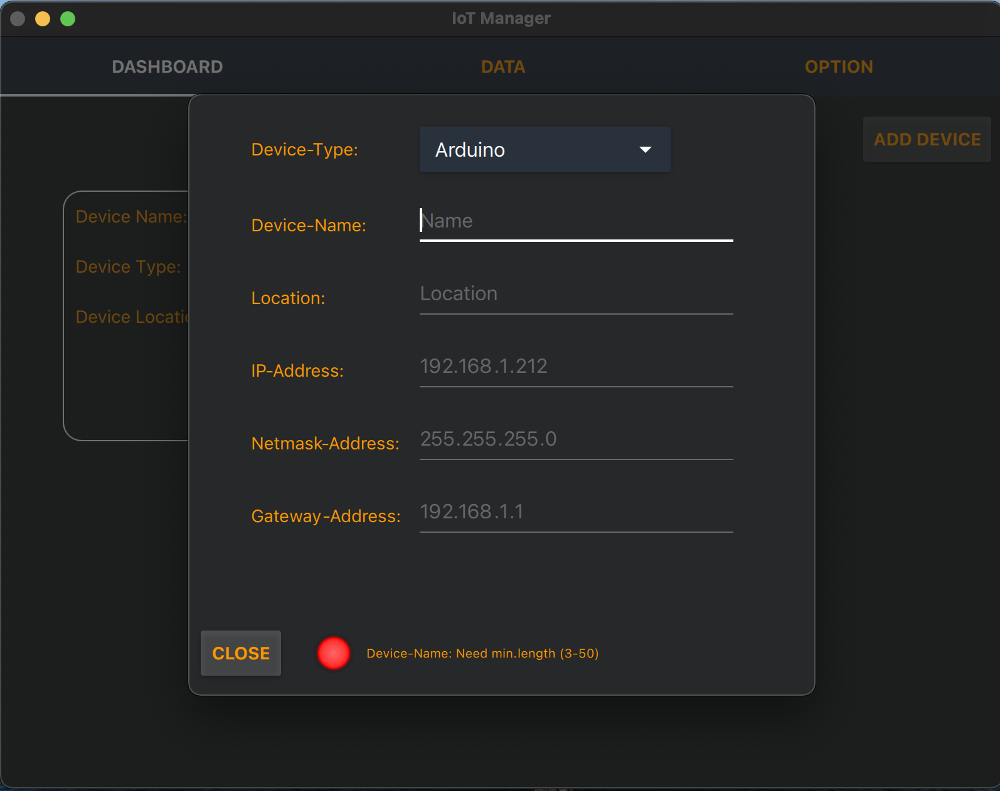
#### Data:
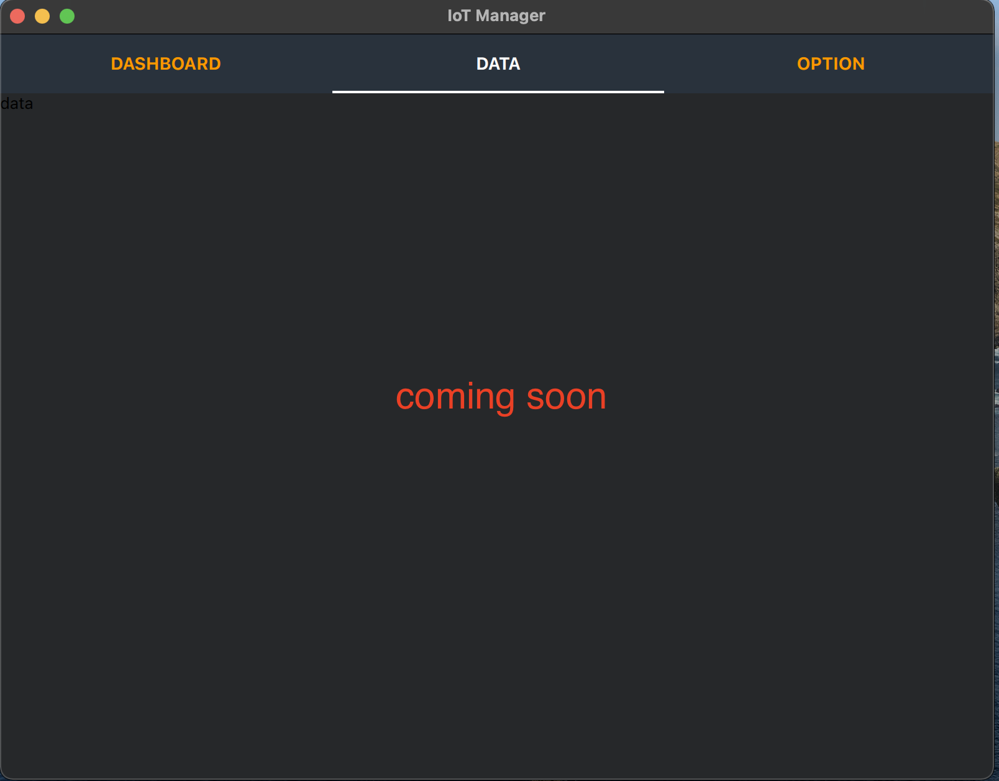
#### Option:
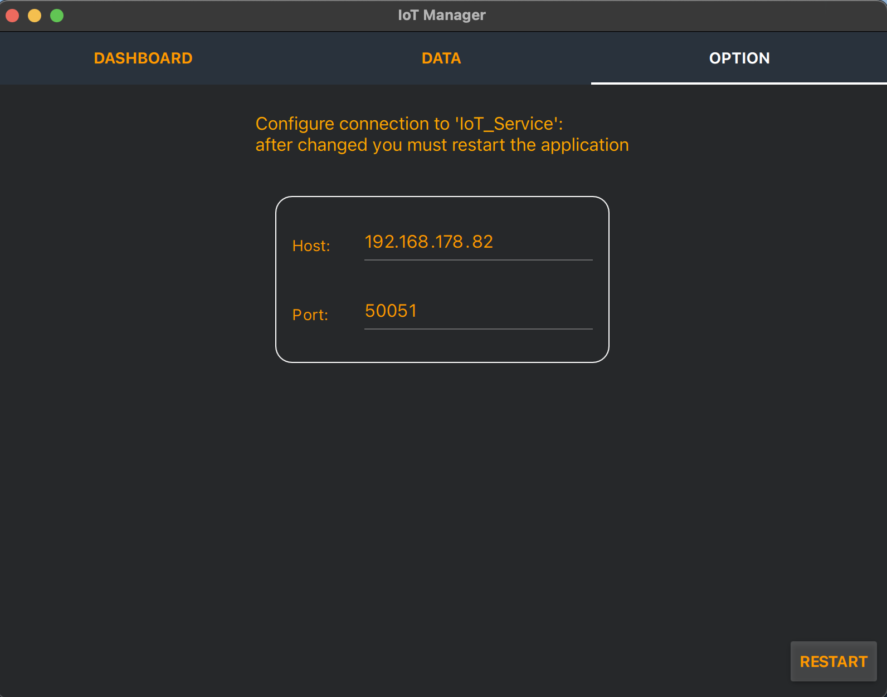


### Device
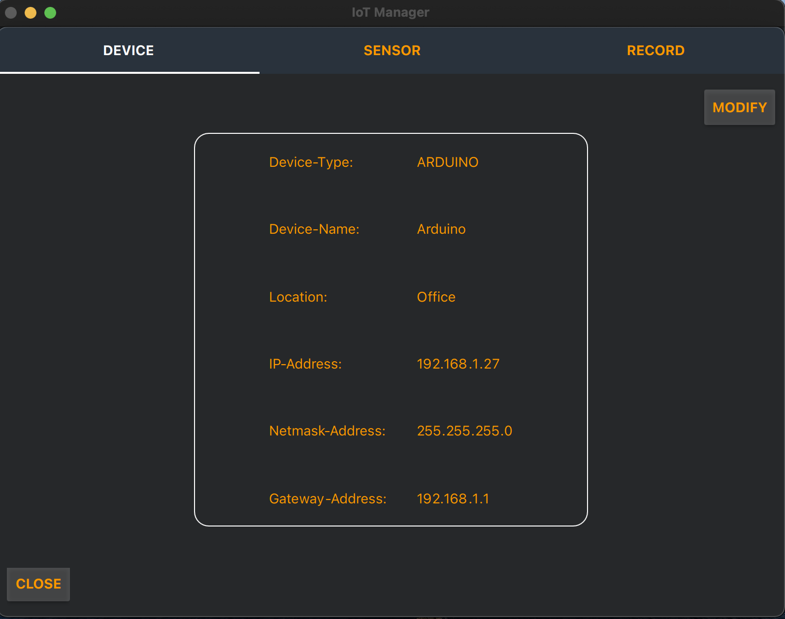
#### modify device:
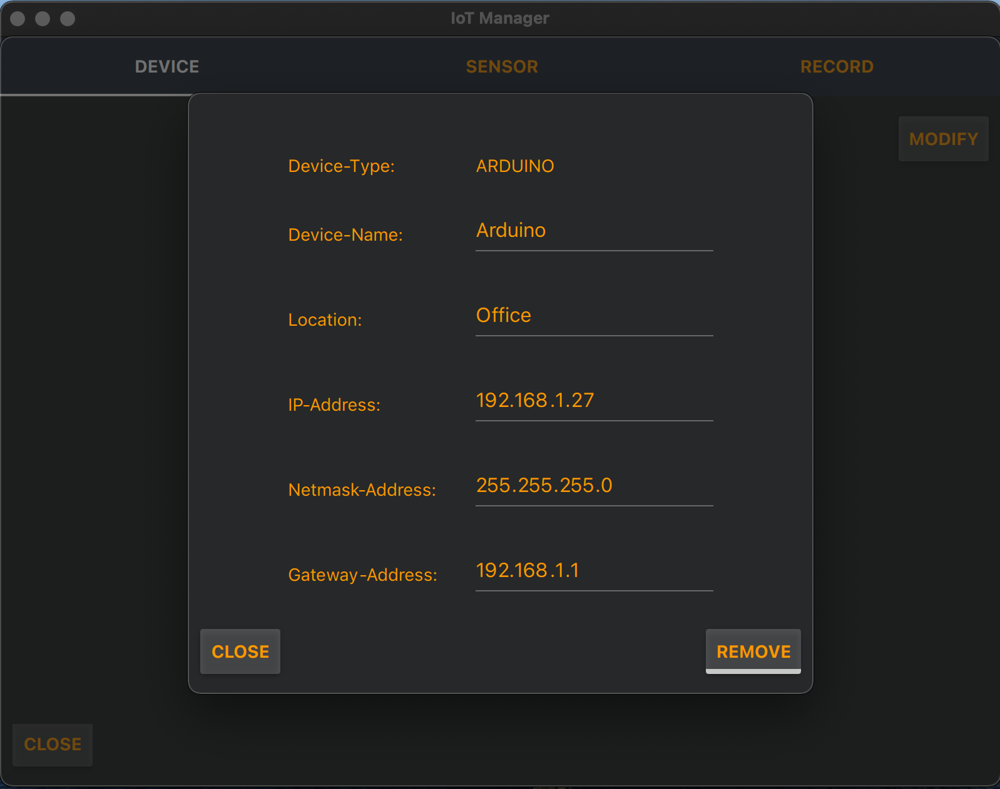

### Sensor:
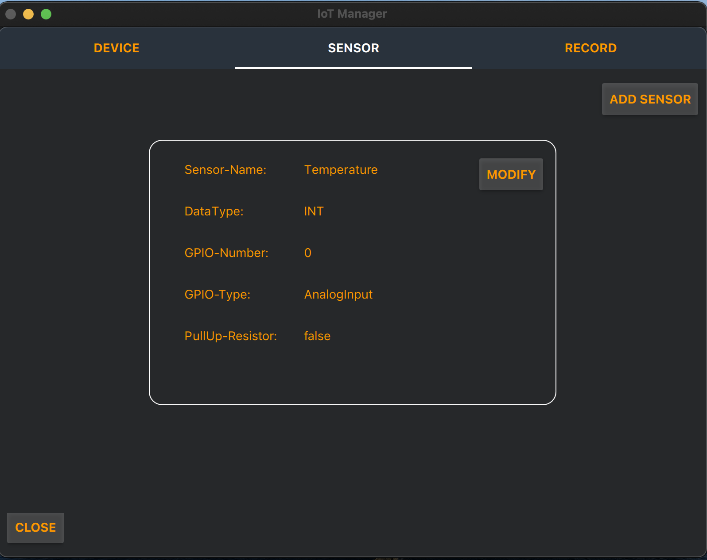
#### Add sensor:
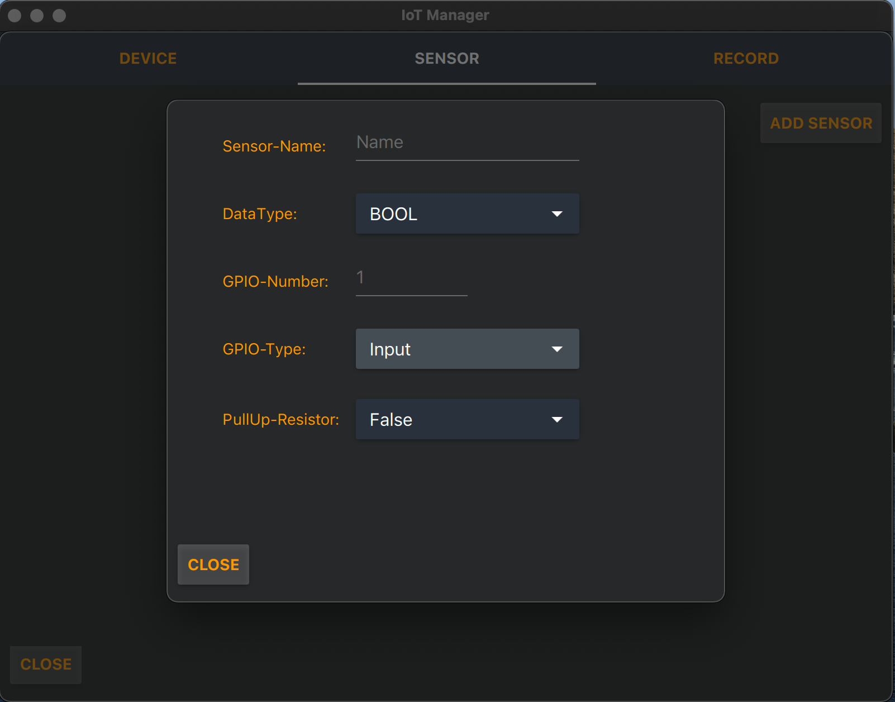
#### Modify sensor:
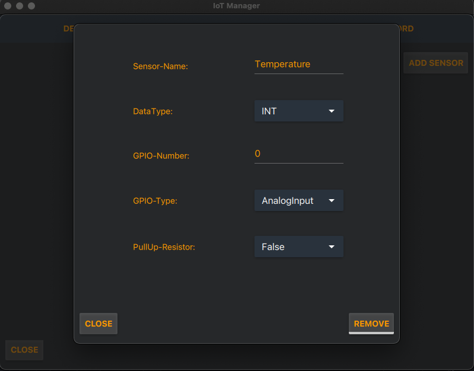

### Record:
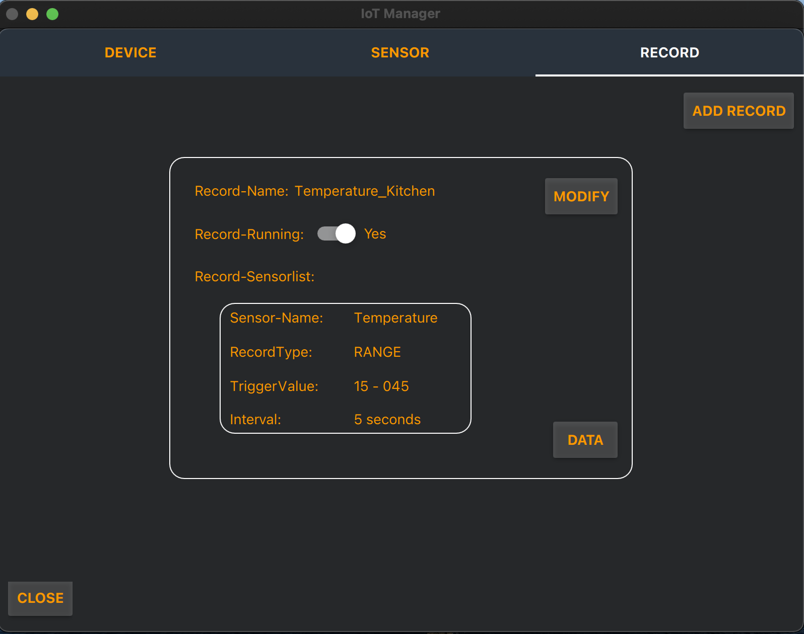
#### Add record:
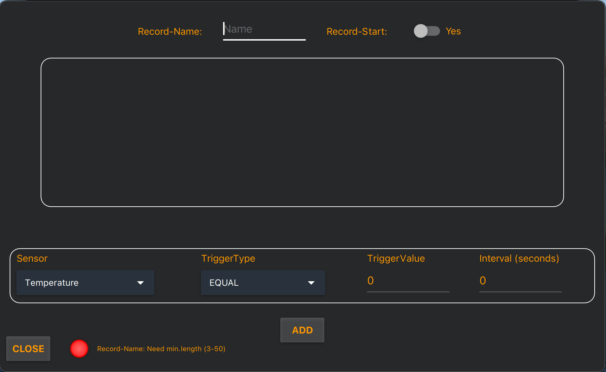
#### Modify record:
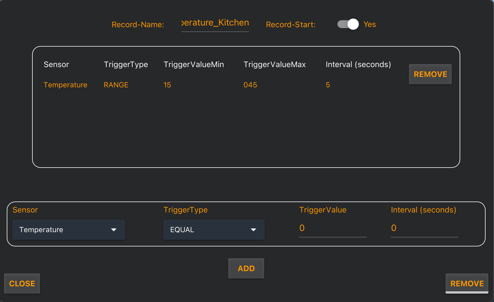